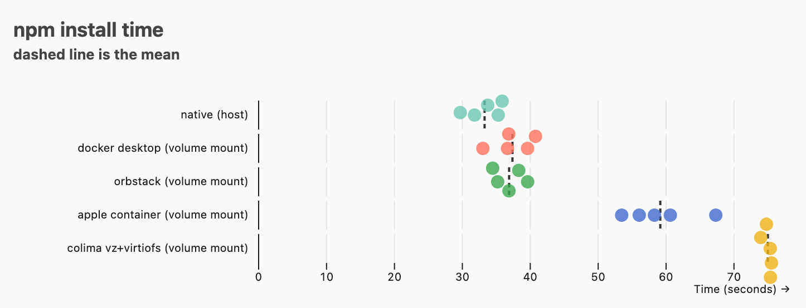

# A Simple Mac Container Filesystem Performance Benchmark

This benchmark is a simple test of bind filesystem performance, done because I've found container filesystems to be consistently slow on Mac OS, which has prevented me from using them regularly.



The process is:

- make sure npm has a cold cache
- run `npm install`, either natively or in a container with a bind mount

The versions under test here are:

| software       | version                                                                            |
| :------------- | :--------------------------------------------------------------------------------- |
| node           | v24.16.0                                                                           |
| npm            | 11.13.0                                                                            |
| docker desktop | 29.5.3                                                                             |
| container      | container CLI version 1.0.0 (build: release, commit: ee848e3)                      |
| orb            | Version: 2.2.1 (2020100) Commit: 0e182b501fcd9e05b99ffb363fce03610390c400 (v2.2.1) |
| colima         | colima version 0.10.3                                                              |
| hyperfine      | hyperfine 1.20.0                                                                   |

I'm using the `node:24.16.0-slim` image available as of jun 10

## Environments

| Environment            | Description                                                               |
| :--------------------- | :------------------------------------------------------------------------ |
| **Native (host)**      | `npm install` directly on macOS (Apple Silicon), cold cache               |
| **OrbStack**           | `docker run` via OrbStack, volume mount                                   |
| **Apple Container**    | `container run` with `-v` volume mount (Apple's native container runtime) |
| **Docker Desktop**     | `docker run` via Docker Desktop with default settings (virtiofs)          |
| **Colima vz+virtiofs** | `docker run` via Colima using the `vz` VM backend + `virtiofs` mount type |

All container tests mount the project directory as a volume, so `node_modules` is written across the virtualization boundary.

## Results


all times in seconds. Test was done on a macbook m2 max with 32gb of memory, connected to power

| Test            | mean   | stdev | min    | max    | ratio       |
| :-------------- | :----- | :---- | :----- | :----- | :---------- |
| native          | 33.275 | 2.547 | 29.696 | 35.860 | 1           |
| orbstack        | 36.890 | 2.132 | 34.463 | 39.615 | 1.11 ± 0.11 |
| docker desktop  | 37.378 | 3.011 | 33.026 | 40.775 | 1.12 ± 0.12 |
| apple container | 59.150 | 5.284 | 53.463 | 67.324 | 1.78 ± 0.21 |
| colima          | 74.992 | 0.647 | 73.949 | 75.518 | 2.25 ± 0.17 |

orbstack and docker desktop are about 10% slower than native. This is actually better performance form docker desktop than I've seen in the past - I have definitely experienced 2x install times before.

Apple `container` is slower, and colima slower still.

I had not previously used `orbstack`, and was only prompted to by a developer asking me about it on news.yc; I may be checking into it more.

## Reproducing

```bash
mise install

# Start all runtimes
colima start --vm-type vz --mount-type virtiofs
container system start
# Docker Desktop: install from https://docker.com/products/docker-desktop and start the app
# OrbStack: install from https://orbstack.dev and start the app

# Pull the node image into each runtime
docker --context colima pull node:24.16.0-slim
docker --context desktop-linux pull node:24.16.0-slim
docker --context orbstack pull node:24.16.0-slim
container image pull node:24.16.0-slim

# Run benchmarks
bash run-benchmark.sh
```

## Why this benchmark sucks

I made `npm install` the benchmark because it's an extremely common thing I do when working with code, and it shows a pain point for container usage in my experience on mac: working with lots of files is very slow.

This has made it painful for me to try and use containerized solutions for local dev on macs in javascript/typescript, python, and rust, all of which depend on a large number of files living in something like a `node_modules` folder.

However, this benchmark relies on the network. It was run on my computer while I browsed the internet. It was run on a computer that has lots of other services running on it.

You should take these results with a bucket full of salt!

The results for apple's container and colima both align with my experiences, and I would expect docker desktop to have similar results.

## You did this wrong

Please file an issue if you have an idea for how I can do it better! PRs and issues are welcomed. I'm available on [bsky](https://bsky.app/profile/billmill.org), [masto](https://hachyderm.io/@llimllib) and [email](mailto:bill@billmill.org)
